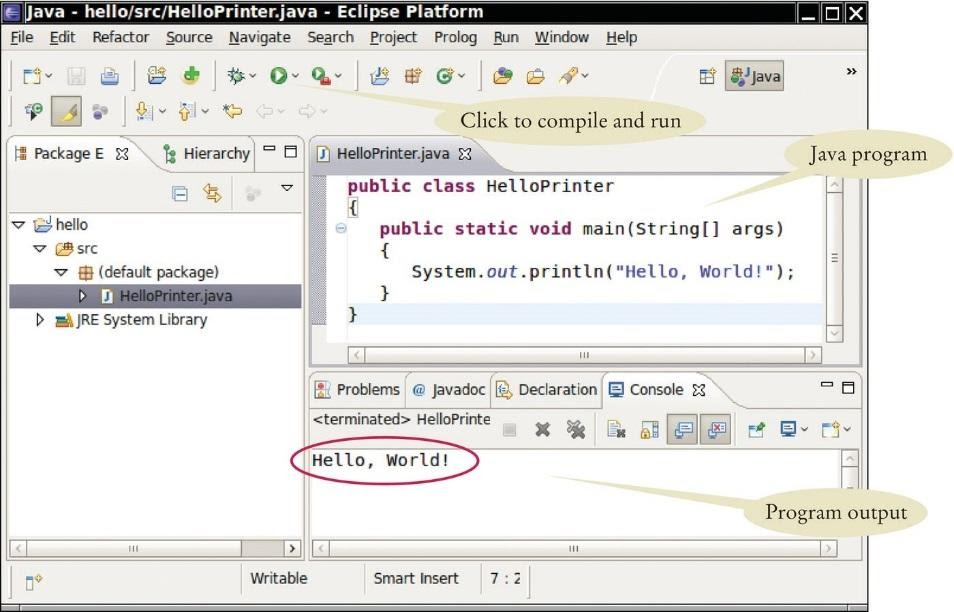

# CSC 151: Chapter 1

- [☕ Java programming language](#java-programming-language)
- [📦 Programming environments](#programming-environment)
- [🕵️‍♀️ Your first program](#analyzing-your-first-program)
- [❗ Errors](#Errors)
- [🧪 Quiz](./quiz.md)
- [👩‍💻 Assignment](./assignment.md)

This chapter has useful information regarding the history of programming and how it is all set up. On this page we cover:

```|{type:'youtube'}
https://www.youtube.com/embed/AdhltpiIlEI
```

## Java Programming Language
Java is a high level programming language.  A compiler will translate the high level instructions into more detailed instructions (called machine code).  It was created in 1991 at Sun Microsystems.   Java was designed for the internet which makes it portable and great learning tool.  It is also platform independent, which means it will run on Linux, UNIX, Windows, or Macs.  The code is run on the Java Virtual Machine which simulates a real CPU.  Java also contains library packages that can be brought in to enhance the language.


## Programming Environment

We will program in Java 11.  Download Java first.  The programming environment is considered an IDE (integrated development environment).  We will be using Eclipse software as our IDE to write our code and it is a [free download](https://www.eclipse.org/downloads/packages/). Again, [download Java first](https://www.oracle.com/java/technologies/javase-jdk11-downloads.html).

```|{type:'youtube'}
https://www.youtube.com/embed/XvL61_dznwA
```
<br>

### Steps to Write a Program:



1. Open Eclipse. Start a new Java project. Give the project a name. Click Finish.

2. Write a simple program. I am going to provide code below. I will explain more regarding this code a little later. The name of your file should be `HelloPrinter.java`.

```java
public class HelloPrinter {
	public static void main(String [] args) {
		System.out.println("Hello, World!");
    }
}
```

3. Click Run (green arrow).  This translate your source file into class file.  The class file is what the Java virtual machine uses to run.  


## Analyzing your First Program

We are going to breakdown the following program. First thing, capitalization matters!

### public class HelloProgram
```java |{type:'info', range: {start:0, end: 0}}
public class HelloProgram {
   public static void main(String [] args) {
        System.out.println("Hello World!");
   }
}
```

```|{type:'youtube'}
https://www.youtube.com/embed/RxmoZJNyiFI
```

<br>

`public class HelloProgram` it the class declaration. The class is named `HelloProgram` Every program in Java needs to be inside at least one class. We will delve into classes deeper as we move forward.

```|{type:'youtube'}
https://www.youtube.com/embed/xxd5eE-XvV0
```
<br>

The keyword `public` means everyone can access the class. This is considered the source file, at it needs to have at least one public class.

The file name MUST match the class name.  Your file should be named `HelloProgram.java.` All code for the class must be within the open and close curly braces `{ }`.

### public static void main(String [] args)

```java |{type:'info', range: {start:2, end: 2}}
public class HelloProgram {
   public static void main(String [] args) {
        System.out.println("Hello World!");
   }
}
```

```|{type:'youtube'}
https://www.youtube.com/embed/9WIPStuqGY4
```
<br>

`public static void main(String [ ] args)` is a method. All code for the method must be within the curly braces (just like the class).  The method’s name is main.  Every Java application must have a main method.  This is what is run by the machine.  It may contain other methods. We will breakdown the `static`, `void`, and `String [] args` later.

### System.out.println("Hello World!")

```java |{type:'info', range: {start:4, end: 4}}
public class HelloProgram {
   public static void main(String [] args) {
        System.out.println("Hello World!");
   }
}
```

```|{type:'youtube'}
https://www.youtube.com/embed/McRErMEp7_0
```
<br>

Inside main, you can put statements or instructions. We only have one statement inside our main method which is `System.out.println(“Hello World”)`. Each statement must end in a semicolon (`;`). When the program runs, it starts at the first line inside main and moves down.

```|{type:'youtube'}
https://www.youtube.com/embed/HYDHaLUmGbA
```
<br>

Our statement prints "Hello World" onto the screen. We call a method (instead of just writing one) with the `System.out.println(…)` part of the code. The "Hello World" part is what we want to appear on the screen. It is called an argument. There are two print methods you should be aware of to get started:

- `System.out.println("...")` will print text on a line and leave the cursor on the following line.
- `System.out.print("...")` will print the text on a line and leave the cursor following the text. 

Notice that "Hello World" is enclosed in double quotations. This means it is considered a `string`. A string is any text inside quotations. _If you try to print text without quotations you will get an error_.

The only exception is numbers. You can put numbers in without quotations and it will just print the number. Also, math can be done inside the parenthesis. For example, the statement below will print 7 on the screen.

```java
System.out.println(3 + 4);
```


## Errors

```|{type:'youtube'}
https://www.youtube.com/embed/ZNh82Y_2vO0
```
<br>

### Syntax errors

These errors are produced by Java when it is translating the source code into byte code. They usually indicate that there is something wrong with the syntax of the program. 

_Example_: Omitting the semicolon at the end of a statement yields an error message.

```|{type:'youtube'}
https://www.youtube.com/embed/SCJBFiBPfKM
```
<br>


### Runtime errors

These errors are produced by the runtime system if something goes wrong while the program is running. Most runtime error messages include information about where the error occurred and what functions were executing.

_Example_: divide by zero

```|{type:'youtube'}
https://www.youtube.com/embed/FrRkLzlq08w
```
<br>


### Logic errors

These problems are with a program that compiles and runs but doesn’t do the right thing. 

_Example_: A mathematical expression may not be evaluated in the order you expect, yielding an unexpected result.

```|{type:'youtube'}
https://www.youtube.com/embed/mkaS_yv3Jyk
```
<br>


## Code Development

```|{type:'youtube'}
https://www.youtube.com/embed/fy_d8D9vam0
```
<br>

An algorithm for solving a problem is a sequence of steps that is unambiguous, executable, and terminating. These precise steps help you write programs. Many programmers want to skip this step, but it is crucial to write good code.  First, figure out the steps you need to solve the problem.  Next, pseudocode (loosely written code) the problem. There is not a wrong way to write out the code in this step, as long as it is logical order. The last step is turning your algorithms and pseudocode into actual code. 

### Example 1

Goal: Write a program that prints "Hello" and "Bye" on separate lines.

_You can make changes below and run the code in your browser by clicking on the ▶ icon on top right corner of the code._

```java | {type: 'script'}
public class ExampleOne {

	public static void main(String [] args) {
		System.out.println("Hello");
        // TODO: complete the program after this line...
		
	}
}
```

Follow this video to learn how to start a project in Eclipse, and run the same code above in Eclipse:

```|{type:'youtube'}
https://www.youtube.com/embed/pkjVDA4NV2k
```
<br>


### Example 2

If you remember we talked about `strings` which are created by adding quotations around things. What do you think `5 + 10` will print? How about `"5+10"` or `5 + 10 + " 5+10"`? 

Use the code below as a playground to modify, run ▶, and experiment with different values.

```java | {type: 'script'}
public class ExampleTwo {

	public static void main(String[] args) {
		System.out.println(5 + 10);
		System.out.println("5+10");
		System.out.println("5+10 " + 5 + 10);
		System.out.println(5 + 10 + " 5+10");
		System.out.println("5+10 " + (5 + 10));

	}
}
```

Follow this short video to learn how to run the same code as above in Eclipse:

```|{type:'youtube'}
https://www.youtube.com/embed/fyab3ibhulQ
```
<br>
