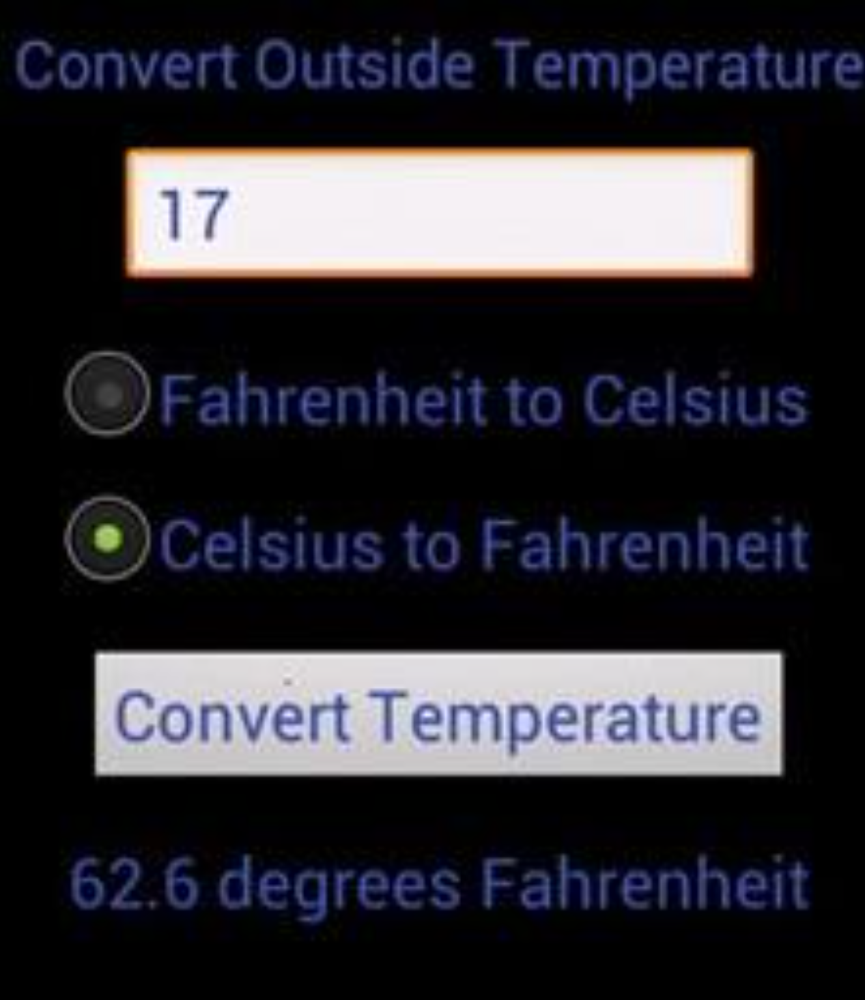

# CSC 151: Chapters 10 and 11 Assignments

```|{type:'youtube'}
https://www.youtube.com/embed/AEul1Lv7PaE
```

Complete the following questions.

1. Create an application with three check boxes labeled: "Red", "Green", and "Blue". There will also be text (of your choosing) on the page. When the check boxes are selected, the color of the text will change based on which options have been selected.

<div class="mx-auto" style="max-width: 600px;">


</div>

You should have 8 total color combinations.
- White when all are selected
- Black when none are selected
- Red, Green, and Blue (3 different colors)
- Red and Green make Yellow
- Blue and Red make Magenta
- Green and Blue make Cyan


2. You are creating an app that will convert from Fahrenheit to Celsius or Celsius to Fahrenheit. There should be box to enter in a number value. Then select the appropriate radio button. Once the button is pressed the calculated temperature is displayed. The image is just an example. You don’t need to make it look just like the picture. Be creative.

<div class="mx-auto" style="max-width: 300px;">



</div>

#### Formulas

Be sure to use the decimals as I use them. 
- `C = (F-32) * 5.0/9.0`
- `F = C * 9.0/5.0 + 32`
