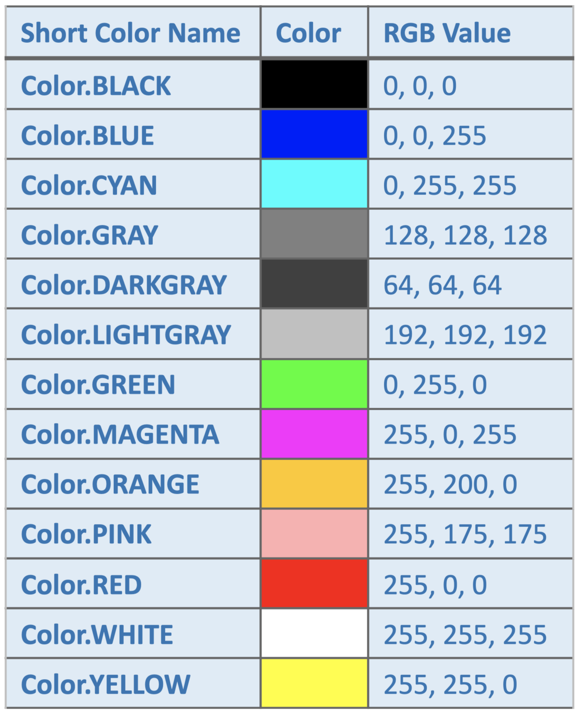
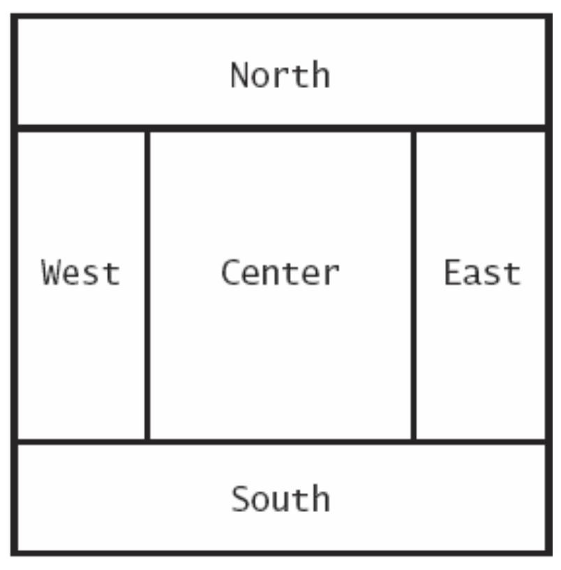
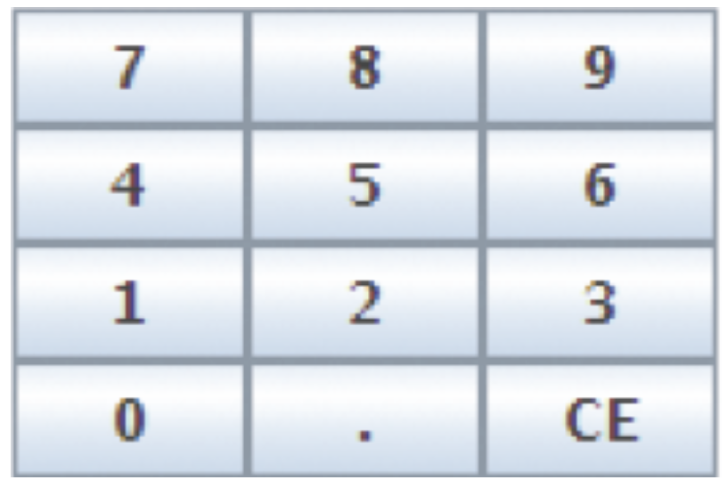
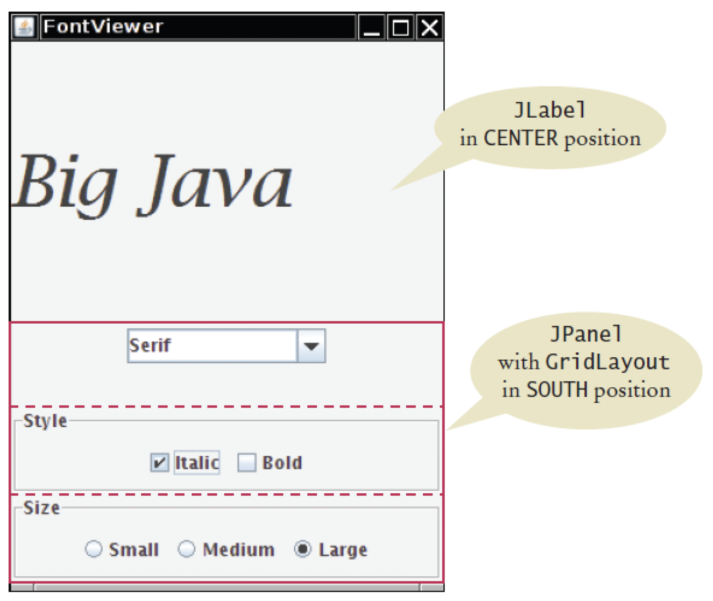
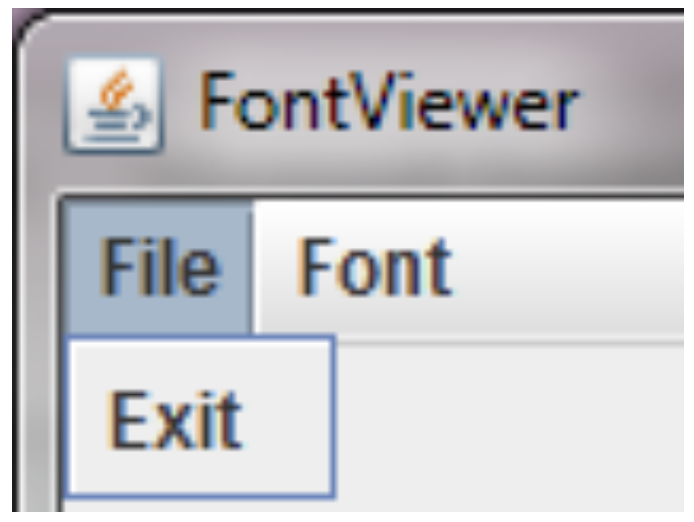

# CSC 151 - Chapters 10 and 11:  Graphical User Interfaces (GUI)

I will be pulling pieces from Chapters 10 and 11. Chapter 10 covers Frames, events, and Text input. Chapter 11 layout managers, choices, and menus.  There is more content in each chapter. I am picking and choosing pieces from each chapter.  You will only need to know what I cover.

## Frame Windows

A graphical application (program) shows information inside a frame.  This fame is a window with a title bar.  

### Creating the Frame

```|{type:'youtube'}
https://www.youtube.com/embed/Synr4DsCKsE
```

These are the steps to create a frame.  You should complete these actions (or call the method to complete these actions) within public static void main.

1. To create one, it is rather easy:
    
  ```java
  JFrame frame = new JFrame();
  ```

2. You can modify the size of the window by:
  ```java
  frame.setSize(300, 400);
  ```

3. If you want to add a title, you complete the following code. If you skip this step, you will not have a title.
  ```java
  frame.setTitle("An empty frame");
  ```

4. Set the default action for closing. (This is what happens when you press the x in the upper right corner). Don’t miss this step. If you do, the process keeps running after you close the window.
  ```java
  frame.setDefaultCloseOperation(JFrame.EXIT_ON_CLOSE);
  ```

5. Make the frame visible. DO NOT SKIP. IF you skip this step, you will never see your GUI.
  ```java
  frame.setVisible(true);
  ```

### Adding Content to the Frame

#### Buttons

A button is a clickable component that you can add to the GUI. We will create it now. We will worry about the clickable part later. The string in the constructor is the text that appears on the button.

```java
JButton button = new JButton("Click me");
```

#### Labels

A label is a non-editable text field. The user cannot type or change the text that appears. The string inside the constructor is the text that appears.

```java
JLabel label = new JLabel("I am text. La la la");
```

#### Panels

When adding content to the frame, it is a good idea to put the content into a panel. The panels will help keep your items separate and it is easier to organize.

```|{type:'youtube'}
https://www.youtube.com/embed/iqobXr6v9ic
```

```java
JPanel panel = new JPanel();
panel.add(button);
panel.add(button);
frame.add(panel);
```

### Inheritance to Customize Frames

The easier way to do all of this is with a separate class.  You can extend `JFrame`, giving you access to all of the content of `JFrame`.

```|{type:'youtube'}
https://www.youtube.com/embed/9QFxGSoUSS0
```

#### Your Frame Class

```java
public class FilledFrame extends JFrame {
  private JButton button;
  private JLabel label;
  private static final int FRAME_WIDTH = 300;
  private static final int FRAME_HEIGHT = 100;

  public FilledFrame() {
    createComponents();
    setSize(FRAME_WIDTH, FRAME_HEIGHT);
  }

  private void createComponents() {
    button = new JButton("Click me!"); 
    label = new JLabel("Hello, World!");
    JPanel panel = new JPanel();
    panel.add(button);
    panel.add(label);
    add(panel);
  } 
}
```

#### The Driver Class

```java
public class FilledFrameViewer2 {
  public static void main(String[] args) {
    JFrame frame = new FilledFrame();
    frame.setTitle("A frame with two components");
    frame.setDefaultCloseOperation(JFrame.EXIT_ON_CLOSE);
    frame.setVisible(true);
  }
}
```

## Events and Event Handling

```|{type:'youtube'}
https://www.youtube.com/embed/kELds9sql3k
```

In GUIs, events consist of mouse moves, button clicks, key presses, menu selections, and so on. For example, it could be clicking the button we just created. When we want action to happen, we need to set up an event listener. This is class that just sits and waits for an action to happen. An event listener belongs to a class created by the application programmer. Its methods describe the actions to be taken when the event occurs. The event source notifies the listener when the event occurs. `ActionListener` is the interface we will be using. In the above example, you could add the following code in the `createComponents` method:

```java
ActionListener listener = new ClickListener();
button.addActionListener(listener);
```

```|{type:'youtube'}
https://www.youtube.com/embed/b2Bl8h6cb7Y
```

To set up the action listener, I would use something called an inner class. This is a class inside of a class. So inside, your Frame class, you would create an `ClickListener` Class.

```java |{type:'info', range: {start:6, end: 6}}
public class FilledFrameViewer2 extends JFrame {
  private JButton button;
  private JLabel label;
  . . .
  class ClickListener implements ActionListener {
    public void actionPerformed(ActionEvent event) {
      label.setText("I was clicked");  
      // This is where you would put what you want to happen
    }
  }
  . . .  // The rest of the class is the same.
}
```

This line of code: `label.setText("I was clicked");` , is how  to change the text for a label.

## Text Input

### JTextField

```|{type:'youtube'}
https://www.youtube.com/embed/bdeCMH66ryc
```

A `JTextField` component will allow you to read in a single line of input from the GUI interface. Generally, a label accompanies the text field, so the user knows what to type in the box. When creating the `JTextField`, supply the width of the field (this is how much room appears for the user to type).

```java
final int FIELD_WIDTH = 10;
myTextField = new JTextField(FIELD_WIDTH);
```

To get the value of the field, you will get the value and _convert it to the number_.

```java
double r = Double.parseDouble(myTextField.getText());
```

### JTextArea

A `JTextArea` is used for multiple lines of text (versus the field, which is a single line).

```java
final int ROWS = 10;  // Lines of Text
final int COLUMNS = 30; // Characters in each Row
JTextArea textArea = new JTextArea(ROWS, COLUMNS);
```

As below you can `setText`/`getText` to set or get the content in the text area.  However, there is also an append open now.

```java
textArea.append("blah blah blah");
```

You can also set the text area to be not editable by the user.

```java
textArea.setEditable(false);
```

You can also add a scroll bar.

```java
JScrollPane scollPane = new JScrollPane(textArea);
```

## Color

```|{type:'youtube'}
https://www.youtube.com/embed/Z3LsdLF9dbc
```

You can change the color of text, shapes, and backgrounds easily by using the built in colors with Java.

```|{type:'youtube'}
https://www.youtube.com/embed/U8XTifFYjYA
```

<div style="max-width: 400px;">



</div>

See list of these colors in [Java docs here](https://docs.oracle.com/en/java/javase/11/docs/api/java.desktop/java/awt/Color.html).

To change the color, you need to change the foreground.

```java
button = new JButton("Click me!"); 
label = new JLabel("Hello, World!");
label.setForeground(Color.RED);
button.setForeground(Color.BLUE);
button.setBackground(Color.BLACK);
JPanel panel = new JPanel();
panel.add(button);
panel.add(label);
add(panel);
```

The label and the text on the button would be changed to their respective colors with the `setForeground` method. The `setBackground` method with the button would change the color of the button itself, but not the text.

## Layout Management

So far, your GUI has just been plopping your components wherever it sees fit. A layout manager will allow you to dictate the location of your components. The default layout is the _flow layout_. All items will be placed from left to right and move down a row when more space is needed. Any different layouts exist. We can add our panels (or other container) to the layout at a specific location.

### Border Layout

The border layout is controlled by location. There are five areas: Norths, South, East, West, and Center. When using this layout, you must specify your location.


<div style="max-width: 200px;">



</div>


```java
panel.setLayout(new BorderLayout());
panel.add(myComponent, BorderLayout.NORTH);
```

### Grid Layout

With grid layout the program needs to know how many rows and columns. Remember in computer science, rows generally come first. In the example belopw, there would be 4 rows and 3 columns. When you add components to a grid layout, it will add them from the upper left, across, then down.

<div style="max-width: 200px;">



</div>

In the example below, pretent that buttons have already been created for each number.

```java
JPanel buttonPanel = new JPanel();
buttonPanel.setLayout(new GridLayout(4, 3));
buttonPanel.add(button7); // button7 has already been created...
buttonPanel.add(button8);
buttonPanel.add(button9);
buttonPanel.add(button4);
. . . 
```

## Choices

```|{type:'youtube'}
https://www.youtube.com/embed/mfHA62dE7r0
```

Choices are a set of options for the user to select their option.  You can add action listeners to any of these components.

<div style="max-width: 600px;">



</div>


### Radio Buttons

```|{type:'youtube'}
https://www.youtube.com/embed/Ya76Kep4dvg
```

Radio buttons are mutually exclusive (you can only pick one option). For example, if you order fast food, you cannot select all the sizes: Small, Medium, and Large. You have to select only one size. To make this happen you need to put all radio buttons into a group.  The radio group will prevent multiple choices from happening (behind the scenes).  
When creating a button, the text inside the constructor is the text that will appear next to the button (defaults to the right side of the button). You should create the buttons. Then create the group. Lastly, add the buttons to the group. You can also add a border around the group to make it more visible.

```java
JRadioButton smallButton  = new JRadioButton("Small");
JRadioButton mediumButton = new JRadioButton("Medium");
JRadioButton largeButton  = new JRadioButton("Large");
largeButton.setSelected(true);  
// This means large will already be selected
ButtonGroup group = new ButtonGroup();
group.add(smallButton);
group.add(mediumButton);
group.add(largeButton);
// Add a border around the buttons
JPanel panel = new JPanel();
panel.add(smallButton);
panel.add(mediumButton);
panel.add(largeButton);
panel.setBorder(new TitledBorder(new EtchedBorder(), "Size"));
```

To see if a button has been selected, you would need an if statement:

```java
if (largeButton.isSelected()) {
  size = LARGE_SIZE;
}
```

### Check Boxes

```|{type:'youtube'}
https://www.youtube.com/embed/QreRpioaZDg
```

A check box allows the user to select items. If you have multiple check boxes: zero, some, or all of them could be selected. Think about text inside Word. The text can be bold, italics, and underlined.

```java
JCheckBox italicCheckBox = new JCheckBox("Italic");
if (italicCheckBox.isSelected()) {
  style = style + Font.ITALIC;
}
```

### Combo Boxes

```|{type:'youtube'}
https://www.youtube.com/embed/lSwkA5c97D0
```

Combo boxes are great when you have a large set of choices, instead of a couple. I find that after 4 to 6 choices, it starts looking cluttered.  This behaves similar to radio buttons. You can only select one choice in the drop down. The code below will create the combo box. After creating it, be sure to place it on a panel/frame.

```java
JComboBox mealSizeCombo = new JComboBox();
mealSizeCombo.addItem("Kids");
mealSizeCombo.addItem("Small");
mealSizeCombo.addItem("Medium");
mealSizeCombo.addItem("Large");
```

To get the value the user selected, you need to write this:

```java
String selectedItem = (String)mealSizeCombo.getSelectedItem();
```


## Menus

A frame contains a menu bar. The menu bar contains menus, submenus, and menu items. It looks similar to a drop down combo box. `JMenuBar` is the class you will need to create to use the menus.

```java
public class MyFrame extends JFrame {
  public MyFrame() {
    JMenuBar menuBar = new JMenuBar();
    setJMenuBar(menuBar);
    . . .
  }
  . . .
}
```

<div style="max-width: 200px;">



</div>

To add content to your menus:

```java
JMenuBar menuBar = new JMenuBar();

JMenu fileMenu = new JMenu("File");
//File will have an exit option
JMenuItem exitItem new JMenuItem("Exit");
fileMenu.add(exitItem);

JMenu fontMenu = new JMenu("Font");
//Style will be submenu below Font
JMenu styleMenu = new JMenu("Style");
fontMenu.add(styleMenu);

//adding them to top level menus to the menu bar.  
menuBar.add(fileMenu);
menuBar.add(fontMenu);
```

You need to add action listeners to each menu item. You do not need to add them the menu itself, just the items (the last level). Java already has submenus opening automatically without you adding code.

```java
public JMenuItem createFaceItem(final String name) {
// Final variables can be accessed from an inner class method
  class FaceItemListener implements ActionListener {
    public void actionPerformed(ActionEvent event) {
      facename = name; // Accesses the local variable name
      setLabelFont();
    }
  }
  JMenuItem item = new JMenuItem(name);
  ActionListener listener = new FaceItemListener();
  item.addActionListener(listener);
  return item;
}
```

## Example 1

```|{type:'youtube'}
https://www.youtube.com/embed/VGV8d9kdphI
```

## Example 2

```|{type:'youtube'}
https://www.youtube.com/embed/MDjrKsuNE3Y
```