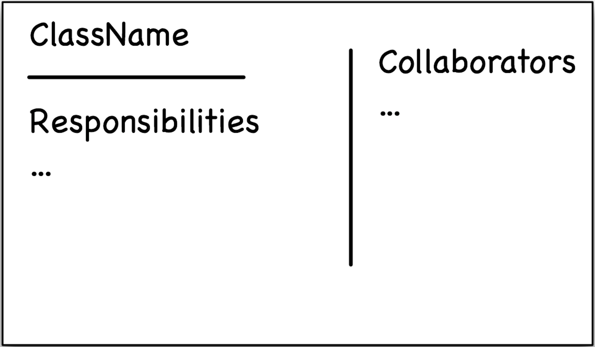
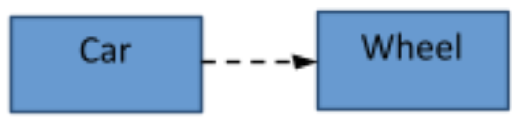
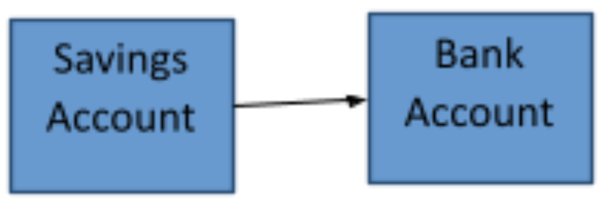
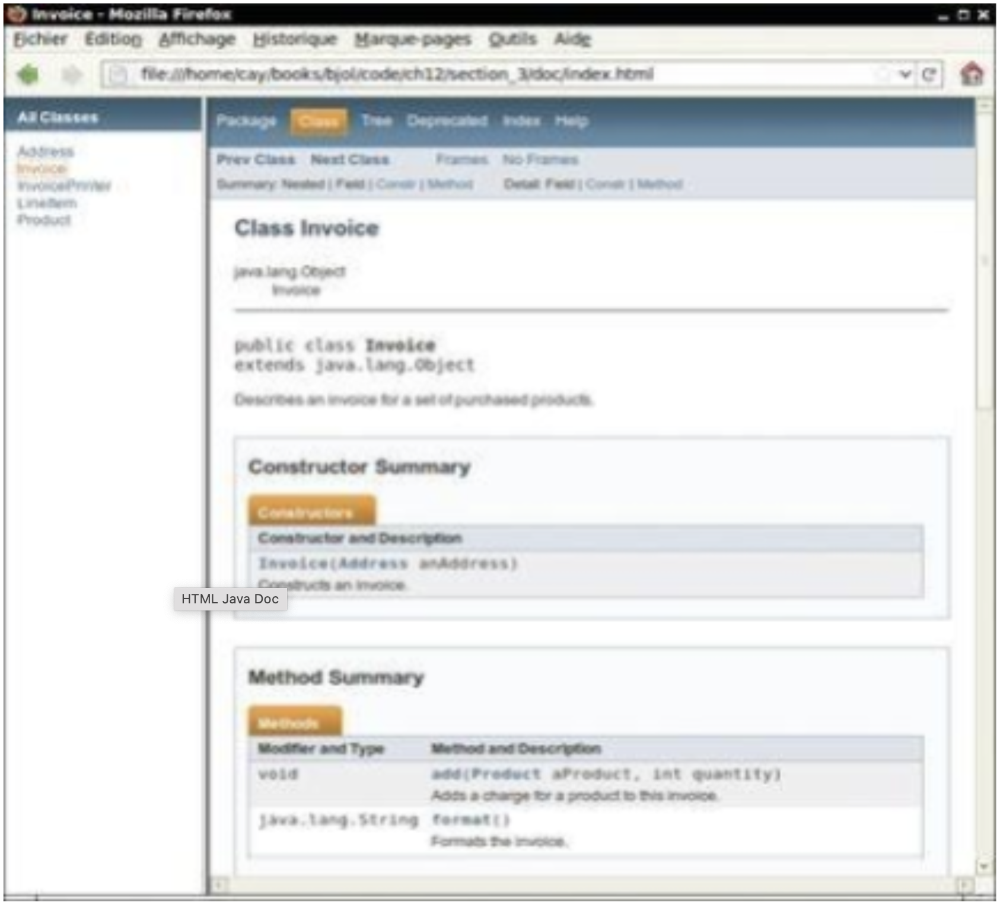

# CSC 151 - Chapter 12: Object-Oriented Design

This chapter we will discover more theory and design behind classes. There is very little new code, other than packages. We will learn to approach the design aspect of coding for object-oriented programs systematically.  

```|{type:'youtube'}
https://www.youtube.com/embed/pC8ve8fXgNk
```

## Classes and Their Responsibilities

When starting to program, it is good idea to access what you have that has been already created. It is usually better to reuse than recreate. You can always recreate if a new classes is needed. Designing a system, look for the nouns and verbs that describe your system.  Nouns are usually classes or instance variables and your verbs are methods.  
For example, the nouns to create an invoice might be customer, invoice, and products. I would create classes for all three of those nouns. Also, note that my class names make sense as to what the object would be defining. A customer class would describe a customer object.

When creating new classes be sure the name is clear as to the objects intention (noun), and think general. If you make classes too specific, you can restrict reusability. Also, think about tasks. Thinking back to the invoice, an Address class could be added. But, pause and think, how would I need to analyze my invoices? If Addresses are not useful, don’t create a separate class and include then within customers. If you have multiple stores, address may be useful.

### CRC Card Method

<br>

<div style="max-width: 400px;">



</div>

Personally, I have never used this method. However, it is a great way to visually layout your classes before starting to program. The first C in CRC stands for classes. The R stands responsibilities. The last C stands for collaborators.  You would use an index card for each class (noun). The class name would go at the top and you would list the responsibilities (verbs) of that class. Beside the responsibility, you would need to list which class is using the action. The responsibilities should be high level tasks. You would not write down all the set/get methods.

```|{type:'youtube'}
https://www.youtube.com/embed/94rp2xz_dao
```

### Cohesion

```|{type:'youtube'}
https://www.youtube.com/embed/W1iPFvGR8ik
```

A class should represent a single concept. The public interface of a class is cohesive if all its features are related to concept that the class represents. This is a probably one of the more important ideas when creating class and super easy to understand, but people mess it up all the time. If there are multiple ideas, you should break it down into two or more classes.

## Relationships between Classes

There are times that classes you create will use other classes and reply on other classes to operate.  We need to breakdown those relationships.

### Dependency

```|{type:'youtube'}
https://www.youtube.com/embed/32XkNPkPEeU
```

A class depends on another class if it uses objects of that class. For example, if I had a wheel and a car class. Car would depend on the wheel class to run (as a car has four wheels). Wheels do not know they are being used by the Car class. But the Car class cannot operate without the Wheel class.

<div style="max-width: 250px;">



</div>

It is good practice to reduce the amount of dependency between classes. If one class gets updating, it would have a ripple effect on all classes using it. The computer science word for this dependency is coupling. The coupling is high if many classes depend on each other. Low coupling is the goal.

Weak coupling should also be avoiding. This is defined as the child in the relationship cannot be created without the parent class.

### Aggregation
*Some books also call this association.*  

```|{type:'youtube'}
https://www.youtube.com/embed/RyaAi0VmPRE
```

This relationship is called the “has-a” relationship. The objects of one class has objects of another class. This is like dependency. However, the biggest difference is that each class could technically exist without the other class.  
A good example of this would be a car and driver. A car has a driver. However, a driver and car would still both exist without each other. A driver could get plugged a different Vehicle and there shouldn’t be an issue. A car can just sit and not be driven.

```|{type:'youtube'}
https://www.youtube.com/embed/yM2BrBFuUv4
```

### Inheritance

```|{type:'youtube'}
https://www.youtube.com/embed/OMWea_nHM8s
```

This is the super/sub class model that we have already looked at in the previous chapters. It is consider as an "is-a" relationship. Using the bank account (super class) and a savings account (subclass). A savings account is a bank account.

<div style="max-width: 250px;">



</div>

Inheritance is the inclusion of behavior (i.e. methods) and state (i.e. variables) of a base class in a derived class so that they are accessible in that derived class. The key benefit of Inheritance is that it provides the formal mechanism for code reuse.

## Documentation

A Javadoc is a Java’s name for their official documentation. The nice piece about their documentation, is you can add it to your code without too much extra work. The javadocs are done through comments. Add their special comment structure, instead of regular comments. It is denoted with the double star (`/**`). You use the at sign (`@`) to denote parameters and returns. When you run it as a Javadoc (versus an application), it will generate an HTML file.

```|{type:'youtube'}
https://www.youtube.com/embed/EJ0f45IbrEU
```

### Code

This is the start of the code.

```java
/**
Describes an invoice for a set of purchased products.
*/
public class Invoice {

    /**
    Adds a charge for a product to this invoice.
    @param aProduct the product that the customer ordered
    @param quantity the quantity of the product
    */
    public void add(Product aProduct, int quantity) {  
        // code goes here
    }

    /**
    Formats the invoice.
    @return the formatted invoice
    */
    public String format() {
        //code goes here
    }
}
```

### HTML Result

This is just the first bit of the results.

<div style="max-width: 500px;">



</div>

## Packages

A package is a set of related classes. You can create your own packages in Eclipse (in class I normally use the default package out of laziness).

Once you create your own package Eclipse will automatically add

```java
package packageName;
```

at the top of your document. Packages are very important in mobile application development and I would strong encourage you to use them there. Pick a unique package name.

There are built in packages that we import. Some of the important Packages in Java are:

| Package       | Purpose                                 | Sample Class |
|---------------|-----------------------------------------|--------------|
| `java.lang`   | Language Support                        | Math         |
| `java.util`   | Utilities                               | Scanner      |
| `java.io`     | Input and Output                        | PrintStream  |
| `java.awt`    | Abstract Windowing Toolkit              | Color        |
| `java.net`    | Networking                              | Socket       |
| `java.sql`    | Database Access through SQL             | ResultSet    |
| `javax.swing` | Swing User Interface                    | JButton      |
| `org.w3c.dom` | Document Object Model for XML documents | Document     |

