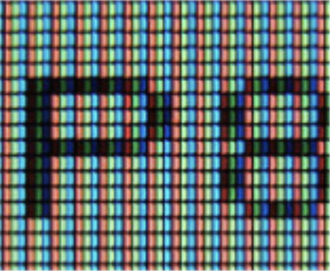

# CSC 151: Chapter 4

This chapter we will cover loops.  This includes while for, and do loops.  We will also look at nested loops, basic algorithms, and hand tracing code.  

## Random Numbers

Random numbers can be generated through built in methods. Random numbers are great for games, security, and fun computer programs. The function returns a random number between 0 (inclusive) and one (exclusive). To increase or change the range you need to a little extra math.

```|{type:'youtube'}
https://www.youtube.com/embed/-5QawJuCkh4
```

For example, you want to throw a 6 sided die, you should do something like this. Run the code and note the roll value changes for each run ▶️:

```java | {type: 'script'}
int roll = (int) (Math.random() * 6) + 1;
System.out.println(roll);
```

Keep in mind, this is a computer, while the numbers may seem random. [They are based on formulas](https://en.wikipedia.org/wiki/Pseudorandom_number_generator). So they are not _truly random_.

## The While Loop

```|{type:'youtube'}
https://www.youtube.com/embed/F_7tXajbn4c
```

```|{type:'youtube'}
https://www.youtube.com/embed/rbbldK75YIM
```

Every program we have done so far has been a single pass assignment. Now, we are going to create a multi-pass program. As a reminder a single pass program starts with the first line and then goes down from there. A multi-pass program is the program that will repeat sections of code.

Control structures change the order that statements are executed or decide if a certain statement will be run. Computers are often used to automate repetitive tasks. Repeating identical or similar tasks without making errors is something that computers do well and people do poorly. Repeated execution of a set of statements is called _iteration_. Because iteration is so common, Java provides several language features to make it easier.  Here's the source structure for a program that uses the `while` control structure.

```java
while (Boolean expression) {
	// do this again and again 
    //     as long as `expression` is true
}
// outside the loop
```

More formally, here is the flow of execution for a `while` statement:

1. Evaluate the condition, yielding `False` or `True`.
2. If the condition is false, exit the `while` statement and continue execution at the next statement.
3. If the condition is true, execute each of the statements in the body and then go back to step 1.

All the Boolean expressions and operators we learned last time are valid.  So, we can still use and, or, not, as well as the greater than/less than/equal chart.

### Basic While Loop Example

```|{type:'youtube'}
https://www.youtube.com/embed/FtAGH9aq0Y0
```

### Infinite loops

```|{type:'youtube'}
https://www.youtube.com/embed/6nvoGVYG3bk
```

The body of the loop should change the value of one or more variables so that eventually the condition becomes false and the loop terminates. Otherwise the loop will repeat forever, which is called an _infinite loop_. An endless source of amusement for computer scientists is the observation that the directions on shampoo, Lather, rinse, repeat, are an infinite loop.

Now that we have while loops, it is possible to have programs that run forever. An easy way to do this is to write a program like this:

```java
while (1 == 1)
   System.out.println("Help, I'm stuck in a loop.");
```

As a reminder, the `==` operator is used to test equality of the expressions on the two sides of the operator.

This program will output `Help, I'm stuck in a loop`. until the heat death of the universe or you stop it, because 1 will forever be equal to 1.

The way to stop it is to hit the Control (or `Ctrl`) button and `C` (the letter) at the same time. This will kill the program. (Note: sometimes you will have to hit enter after the Control-C.) On some systems, nothing will stop it short of telling windows to 'End Now' a non-responding program--so avoid!

### Off by One Error

Another common error is the off by one error. This means your loop will execute one too many or too few times.  Usually these occur when you forget that zero counts as an iteration, or you don’t know when to use `<` or `<=`.

### Tracing a program

To write effective computer programs a programmer needs to develop the ability to `trace` the execution of a computer program. Tracing involves becoming the computer and following the flow of execution through a sample program run, recording the state of all variables and any output the program generates after each instruction is executed.

To keep track of all this as you hand trace a program, make a column heading on a piece of paper for each variable created as the program runs and another one for output. Let’s use a new example:

```|{type:'youtube'}
https://www.youtube.com/embed/u5tOQDVNTL0
```

```java
System.out.println("Please enter an integer: ")
int n = in.nextInt(); // Assume a scanner has been setup 
while (n != 1) {
    System.out.println(n);
    if (n % 2 == 0)      // n is even
        n = n / 2;
    else                 // n is odd
        n = n * 3 + 1;
}
```

This code really doesn’t do anything but will be complicated to trace.   

Let’s pretend the user entered 3 into the program.  Our trace so far would look something like this:

| n  | output |
|----|--------|
| 3  | 3      |
| 10 | 10     |
| 5  | 5      |
| 16 | 16     |
| 8  | 8      |
| 4  | 4      |
| 2  | 2      |
| 1  |        |


Tracing can be a bit tedious and error prone (that’s why we get computers to do this stuff in the first place!), but it is an essential skill for a programmer to have. From this trace we can learn a lot about the way our code works.

## The For Loop

```|{type:'youtube'}
https://www.youtube.com/embed/hNJ0egsCyc8
```

A `for` loop iterates through each value in a sequence. Often you know exactly how many times the loop body needs to be executed, so a control variable (like a counter), can be used to count the executions. Some  call this loop a count controlled loop or definite.

Everything that can be done with `for` loops can also be done with while loops but `for` loops give an easy way to go through all the elements in a list or to do something a certain number of times. `for` loops will also make arrays easier when we get to that unit. Make sure you check your bounds! No off by one errors.

The `for` loop is broken into three pieces: _initialization_ (possibly declaration as well), _condition_, and the _counter_.  All three belong in the for loop header separated by semicolons. You can either count up or down.  The counter does not need to move by one.  However, it should move at consistent intervals.

#### 1. Initialize counter

Set `counter = 1`.

```java |{type:'info', range: {start:0, end: 0}}
for (counter = 1; counter <= 10; counter++) {
    System.out.println(counter);
}
```

#### 2. Check condition

Check `counter <= 10`.

```java |{type:'info', range: {start:0, end: 0}}
for (counter = 1; counter <= 10; counter++) {
    System.out.println(counter);
}
```

#### 3. Execute loop body

Run inside the loop, in this case `System.out.println(counter)`.

```java |{type:'info', range: {start:1, end: 1}}
for (counter = 1; counter <= 10; counter++) {
    System.out.println(counter);
}
```

#### 4. Update counter

Finally update the counter value by running `counter++`. So now counter is 2.

```java |{type:'info', range: {start:0, end: 0}}
for (counter = 1; counter <= 10; counter++) {
    System.out.println(counter);
}
```

Then repeat from step 2.

Let's try running this for loop ▶️ . Change different parts of the loop to experiment and run the loop again:

```java | {type: 'script'}
for (int counter = 1; counter <= 10; counter++) {
    System.out.println(counter);
}
```

### For Loop Example

```|{type:'youtube'}
https://www.youtube.com/embed/zOAXb1NzdF0
```

## The Do Loop

```|{type:'youtube'}
https://www.youtube.com/embed/r0rdnm-NViA
```

The do loop behaves very similar to the while loop, except one big difference. The do loop will always execute at least once. The condition is checked at the bottom of the loop instead of the top.  

```java
do {
	// statements
}
while (condition);
```

It is called a _post-test_ loop (instead of a _pre-test_ loop like `while` and `for`).

Let's see equivalent of the `for` loop we saw above using do while loops ▶️

```java | {type: 'script'}
int counter = 1; // initialize counter

do {
    System.out.println(counter);
    
    counter++; // update counter
                // Note: we need to update counter,
                // otherwise we will have an infinite loop
                // that never ends!
}
while (counter <= 10); // check condition
```

> 🤔 What if our condition was `counter <= 0`. Would this `do-while` loop and the previous `for` loop behave differently? Update the condition in the code above to run and see the different! 

## Common Looping Algorithms

I am not typing out all these coding examples.  We will run through a couple of these in class.  Please see the book or PowerPoints for all examples.  They include:  sum, average, counting, repeating until a match, max, min, and comparing.

## Steps in Writing a Loop

```|{type:'youtube'}
https://www.youtube.com/embed/P8_2p2rWKBo
```

#### Planning:

1. Decide what work to do inside the loop. What are you wanting to repeat? Reading in a number?  Adding?

2. Specify the loop condition. How will you know when the loop is finished?

3. Determine loop type. Count controlled (for), event controlled (do, while)

4. Setup variables before the first loop. Figure out all variables, including counters

5. Process results when the loop is finished. Do you need to do anything else to the data from the loop? For example, when finding the average, you need to divide by the total number. 

6. Trace the loop with typical examples. Hand trace it.

#### Coding:

7. Implement the loop in Java – AND TEST IT!!


## Nested Loops

```|{type:'youtube'}
https://www.youtube.com/embed/1C5mdhtIlJo
```

```|{type:'youtube'}
https://www.youtube.com/embed/hQIyTzP6jpw
```

In programming there may arise the need to have a loop inside a loop. Yes, a real possibility - think about two dimensional images or charts. One loop to go over rows and another to go over columns.



When executing these loops start with the outer loop, once you reach the inner loop, loop until you cannot loop anymore. Then continue on with the outer loop. So for each outer loop the inner loop completes all of its iterations.

## Code Example:
```java | {type: 'script'}
int x = 0;
while (x < 3) {
    int y = 0;
    x ++;
    while (y < 2) {
        System.out.println('*');
        y++;
    }
    System.out.println('$');
}
```

#### Output:
Click on the ▶️ button on top right of the code to run it.  What is your output?

The dollar sign `$` represents the outer loops, which executes three times.  The star `*` represents the inner loops, which executes a total of 6 times.

#### Code Tracing:

| x       | y       | Output | Which loop I am currently in |
|---------|---------|--------|------------------------------|
| 0       |         |        | Start                        |
| ~~0~~ 1 | 0       |        | Outer                        |
| 1       | ~~0~~ 1 | *      | Outer to Inner               |
| 1       | ~~1~~ 2 | *      | Inner                        |
| 1       | ~~2~~ 3 | $      | Inner to Outer               |
| ~~1~~ 2 | ~~2~~ 0 |        | Outer (Top)                  |
| 2       | ~~0~~ 1 | *      | Outer to Inner               |
| 2       | ~~1~~ 2 | *      | Inner                        |
| 2       | ~~2~~ 3 | $      | Inner to Outer               |
| ~~2~~ 3 | ~~2~~ 0 |        | Outer (Top)                  |
| 3       | ~~0~~ 1 | *      | Outer to Inner               |
| 3       | ~~1~~ 2 | *      | Inner                        |
| 3       | ~~2~~ 3 | $      | Inner to Outer               |
| 3       | ~~3~~   |        | Top Out Outer but Fails.     |


### Example: Nested Loop Example

```|{type:'youtube'}
https://www.youtube.com/embed/fvqiqL7QbY8
```

### Example: Data Validation Example

```|{type:'youtube'}
https://www.youtube.com/embed/Mh9mIf3LiH8
```
