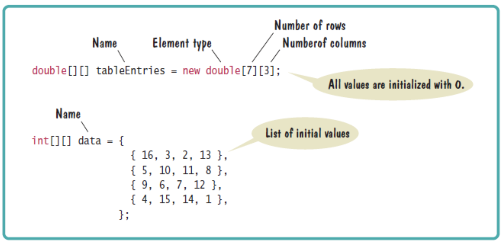

# CSC 151 - Chapter 5: Arrays and Array Lists

This chapter we will cover arrays, array lists and common practices with both.  At the end of the chapter you should be able to set up and use a one dimensional array, a two dimensional array, and an array list.

## Arrays

The array is a fundamental data type. It is one that will hold multiple values under a single name. All of the data stored in a single array must have the same data type. For example, you can have an array of integers (`int`). As it is with regular variables, you need to declare and initialize the array.

### Declare and Initialize an Array

To declare an array you need the _type_ of the array. To declare and array of `double`s:

```java
double [] vals;
```

The square brackets note that you are using an array.

To _initialize_:

```java
vals = new double [10];
```

The steps can be merged into one line too:

```java
double [] vals = new double[10];
```

When initializing an array with primitive data types (`int`, `double`, `char`, `Boolean`), it will set the values to the default value for that type. All numbers default to zero and Booleans default to false. Characters and Strings default to null.

If you know the values of your array when you set it up, you can fill it with those values (instead of the default values). For example:

```java
double [] moreVals = {34, 65, 66.4, 63, 72, 22};
```

This will create an array named `moreVals`. It has the `double` data type. The length is 6.

_⚠️ Note: Once an array size is set, by either method, you are stuck with that size. The size is set! If you need more room, you will have to set up a new array and copy the original content over._

### Use an Array

Once values exist in an array, you can access elements within the array. You can use the _index value_. The index value specifies which slot you are trying to get to within the array (think back to `Strings`). The slot contains an element in the array. I am using the array set up in the previous section.

| **Index**    | 0  | 1  | 2    | 3  | 4  | 5  |
|--------------|----|----|------|----|----|----|
| **`moreVals`** | 34 | 65 | 66.4 | 63 | 72 | 22 |

If I want to change the value of one of the slots, I can access it individually and overwrite the old value.

```java
moreVals[3] = 22.2;
```

Now, the array would look like this:

| **Index**    | 0  | 1  | 2    | 3    | 4  | 5  |
|--------------|----|----|------|------|----|----|
| **moreVals** | 34 | 65 | 66.4 | 22.2 | 72 | 22 |

You can do anything to an element within an array that you could do to a regular variable. For example, you can print out an item in the array. The code below results in 66.4 printed onto the screen.

```java
System.out.println(moreVals[2]);
```

Let's now see this complete example again. Click on the ▶️ button to run this code:

```java | {type: 'script'}
// declare and initialize
double [] moreVals = {34, 65, 66.4, 63, 72, 22};

// print index 3 of the moreVals array
System.out.println(moreVals[3]);

// change the value of index 3
moreVals[3] = 22.2;

// print index 3 of the moreVals array again
System.out.println(moreVals[3]);
```
---

🧑‍💻 Quick activity: Modify the code to change value of index 0 to 5.5, then print index 0.

---

If you try to access an index value outside the array you will get a runtime error. It will crash your program. The array index will always start at zero and the last one will be one less than the length of the array. The error is called a _bounds error_.

Luckily we can access the length of the array very easily. The length of an array is always an `int` (you will never have half a box).

```java
int moreValsLength = moreVals.length;
```

Notice that there are no open and close parenthesis after length. We are getting a value, not calling a method to get the value. We can access this information directly.

What was the length of the array in our last example? Run ▶️ this code to see:

```java | {type: 'script'}
// declare and initialize
double [] moreVals = {34, 65, 66.4, 63, 72, 22};

// getting length of moreVals array
int moreValsLength = moreVals.length;

System.out.println(moreValsLength);
```

### Array References

The array name itself does not hold any values. The name is pointing to the starting position of the array. So the name is holding a _memory address_.

Let’s look at the following code:

```java
int [] scores = {90, 75, 88, 50};
int [] values = scores;
```

The first line of code creates an integer array filled with 4 elements. The second line of code declares an array and sets it equal to the first array.  Because the memory address is stored in `scores` variable, it is actually copying the _memory address_ into `values` variable.

So `values` and `scores` are pointing to the same location. In technical talk, an array reference specifies the location of an array. Copying the reference yields a second reference to the same array.

<div class="mx-auto" style="max-width: 400px;">


</div>

So, if I use change a value in `scores`, the value is also updated in `values`.

Run ▶️ this example to see the output:

```java | {type: 'script'}
int [] scores = {90, 75, 88, 50};
int [] values = scores;

// modify index 3 of scores array
scores[3] = 89;

// check index 3 of the values array
System.out.println(values[3]);
```

### Partially Filled Arrays

At times, you might set up an array larger than you need currently. How do you keep track of what has been filled and is empty. There is no built in way to track this. The smartest way to handle this situation, is to fill the array starting at index value zero. Then create a new int variable to keep track of your current size. Each time you add an element increase the current size variable by one.

## Enhanced `For` Loop

Arrays are so commonly used, that Java developed a better for loop to handle arrays. Keep in mind, a regular `for` loop works just fine.

The biggest drawback to the enhanced `for` loop, is that you cannot make changes to the elements within the array. This loop is great for printing to the screen or a file.

The code below just prints out the contents of an array, using both the regular `for` loop and enhanced version.

Click on the ▶️ button to run these examples:

#### Regular `for` loop example

```java | {type: 'script'}
double [] myArray = {1.0, 2.0, 3.0, 4.0, 5.0};

for (int i = 0; i < myArray.length; i++) {
    System.out.println(myArray[i]);
}
```

#### Enhanced `for` loop example

```java | {type: 'script'}
double [] myArray = {1.0, 2.0, 3.0, 4.0, 5.0};

for (double e : myArray) {
    System.out.println(e);
}
```

## Common Array Algorithms

Your textbook covers many algorithms. You should know all of them. I am going to lightly touch on a couple in my notes.

### Swapping Elements

At times you need to sort an array. To do this, you need to swap values without overwriting or losing one of the values. The easiest way to handle this is to create a temporary variable. In the example below pretend we are switching the values located at the 0 and 1 indices. ▶️

```java | {type: 'script'}
double [] values = {1.0, 2.0, 3.0, 4.0, 5.0};

// Swapping elements:
double temp = values[0];
values[0] = values[1];
values[1] = temp;

// Printing the values array
for (double e : values) {
    System.out.println(e);
}
```

### Copying Arrays

We learned that setting an array equal to another array will just copy over the memory address. Copying over content from one array to another is done frequently enough, that Java created a method to do it for us. You need to import `java.util.Arrays` to use it.

```java
double [] prices = Arrays.copyOf(myArray, myArray.length);
```

First, prices is my new array. It does not need to be the same length as my old array.  My old array is named `myArray`. `Arrays.copyOf` needs to be written as you see it. The second value inside the parenthesis is a number - n.  The `copyOf` method will copy over the first n elements of that array.

Lets see a complete example ▶️

```java | {type: 'script'}
import java.util.Arrays; // don't forget the import

public class Chapter6 {

	public static void main(String [] args) {
        double [] myArray = {1.0, 2.0, 3.0, 4.0, 5.0};

        // Copying myArray into a new variable, prices:
        double [] prices = Arrays.copyOf(myArray, myArray.length);


        // Printing myArray
        for (double e : myArray) {
            System.out.print(e + " ");
        }

        System.out.println();

        // Printing prices (copy of myArray)
        for (double e : prices) {
            System.out.print(e + " ");
        }
	}
}
```


### Sorting and Searching

Sorting is now built into Java, you just have to call it.  It will sort in ascending order.

```java
Arrays.sort(values);      // Sort all of the array
Arrays.sort(values, 0, currentSize);  // partially filled 
```

Like before, make sure you import `java.util.Arrays`.

Lets see a complete example ▶️

```java | {type: 'script'}
import java.util.Arrays; // don't forget the import

public class Chapter6 {

	public static void main(String [] args) {
        double [] values = {4.0, 2.0, 6.0, 1.0, 10.0};

        // Sort all of the array
        Arrays.sort(values);      
        
        // Printing values array
        for (double e : values) {
            System.out.print(e + " ");
        }
	}
}
```

### Linear Search

There are two basic searches you should be aware of as programmers: _linear_ search and _binary_ search. Linear search will go down an array, one element at a time, checking to see if the element matches your search item. The array does not have to be sorted before searching. The search will visit each element one by one until you find a match or reach the end of the array. By including the found flag, it isn’t a true linear search, but could make it much quicker. It will stop as soon as the item is found.

Here is an example for this algorith. Click on ▶️ to run it:

```java | {type: 'script'}
double [] values = {10, 80, 30, 20, 100, 90};
int searchedValue = 100; 

int pos = 0;
boolean found = false;
while (pos < values.length && !found) {
    if (values[pos] == searchedValue) { 
        found = true; 
    }
    else { 
        pos++; 
    }
}

if (found) { 
    System.out.println("Found at position: " + pos); 
}
else {
    System.out.println("Not found");
}
```

Change the value of `searchedValue` variable to 40, and re-run the code. The algorith should print "Not Found" in this case.

### Binary Search

Binary search only works when the array is sorted before you start. First, you compare at the middle element in the array to our item. If the element is larger than what we are looking for, we search the smaller half of the array.  If it is smaller, we search the larger half. Keep repeating this process until you find the target value or cannot split the array.

```java | {type: 'script'}
double [] values = {10, 20, 30, 80, 90, 100};
int searchedValue = 100;

boolean found = false;
int low = 0;
int pos = 0;
int high = values.length - 1;
while (low <= high && !found) {
    pos = (low + high) / 2;  // Midpoint of the subsequence
    if (values[pos] == searchedValue) {
        found = true;        // Found it!
    }      
    else if (values[pos] < searchedValue) {
        low = pos + 1;       // Look in first half
    }
    else {
        high = pos - 1;     // Look in second half
    }
}
if (found) {
    System.out.println("Found at position " + pos);
}
else {
    System.out.println("Not found. Insert before position " + pos);
}
```

Change the value of `searchedValue` variable to 40, and re-run the code. The algorith should print "Not Found" in this case.

## Arrays and Methods

Arrays can be passed to and returned from methods. It is okay to have an array parameters. You can modify the elements within an array also.

However, when an array is passed to a method, it is the reference (aka the memory address) that is passed. Not the actual values of the array. So this means there are now two things pointing at the same array. Any changes to an array within a method are permanent even if the array is not returned.  

## Two Dimensional Arrays

Data, at times, may have a two dimensional layout or organization. A photograph is a great example.  To store the data, the most effective way is a two dimensional array. This is also very useful for mathematical matrices. To declare a two dimensional array, you have two methods just like regular arrays.

<div class="mx-auto" style="max-width: 600px;">



</div>

To access the elements, you must specify the row and column you wish to get:

```java
int foo = myArray[1][2];
```

Let's see a working example. Click on ▶️ to run this example, then make changes and re-run it to better understand how it works:


```java | {type: 'script'}
// declaring and initializing a two dimensional array
int[][] myArray = {
                    {16, 3, 2, 13},
                    {5, 10, 11, 8},
                    {4, 15, 14, 1}
                  };


// getting value of row 2, col 3 (remember index starts from 0)
int foo = myArray[1][2];

System.out.println(foo);
```

This would be the second row and the third column. Remember all counting starts at zero in computer science. The image below shows you how to access the neighboring elements to an element within a two dimensional array. Note, this does not show you potential bounds errors.

<div class="mx-auto" style="max-width: 400px;">


</div>

To run through each item in the array, you need to do a _nested loop_. Generally, the outer loop handles the rows and the inner loop handles the columns. When calling `arrayName.length`, you are accessing the number of rows. The inner loop uses the length of the first row to create the upper bound.

Let's see an example of running through this array ▶️

```java | {type: 'script'}
// declaring and initializing a two dimensional array
int[][] myArray = {
                    {16, 3, 2, 13},
                    {5, 10, 11, 8},
                    {4, 15, 14, 1}
                  };

for (int i = 0; i < myArray.length; i++) {
	for (int j = 0; j < myArray[0].length; j++) {
        // print value and then a tab (remember escape characters?)
		System.out.print(myArray[i][j] + "\t"); 
	}
	System.out.println();
}
```

_Note: You can also create a multidimensional array with varying lengths.  I would avoid this. It gets really complicated._

## Array Lists

### Array List Basics

`ArrayLists` are a built in data structure. It is very similar to arrays with two major exceptions. The `ArrayList` can grow/shrink as needed. There are built in methods to help complete basic tasks. You need to import `java.util.java.util.ArrayList` to use it.

To declare an array list, you should know what type of data you are adding to the array list. You must use _objects_ and cannot use primitive types (`int`, `float`). There are work arounds for primitive types.

```java
ArrayList<String> myList = new ArrayList<String>();
// ArrayList <type> name = new ArrayList<Type> ();
```

If you skip the new part of the set up, you will not initialize the array (not allot space for it). Also when passing array lists to methods, it behaves like regular arrays. A reference will be passed, not the actual values.

There are a couple built in methods you should be aware of for array lists. There are more, but you shouldn’t need more than this.

- `add`:  add an element
- `get`: return an element
- `remove`: delete an element
- `set`:   change an element
- `size`: current length

Examples ▶️

```java | {type: 'script'}
import java.util.ArrayList; // don't forget the import

public class Chapter6 {
	public static void main(String [] args) {

        ArrayList<String> myList = new ArrayList<String>();

        myList.add("Bob");
        myList.add("Mary");
        
        // 1 is the location in the list.  Mary will be bumped and not overwritten
        myList.add(1, "Ann");
        
        // three at this point
        System.out.println(myList.size());
        
        // Bob is printed
        System.out.println(myList.get(0));

        // This changes the element at index 2 to Frodo
        myList.set(2, "Frodo");
        System.out.println(myList.get(2));

        // This will remove Ann
        myList.remove(1);
        System.out.println(myList.size());
    }
}
```

### Enhanced `For` Loops with Array Lists

This is a great way to use the enhanced `for` loop. 

> Quick note: These came out after I learned to program in Java. I default back to the regular `for` loop frequently.

The code below just prints out the contents of an array list, using both the regular `for` loop and enhanced version.

Click on the ▶️ button to run these examples:

#### Regular `for` loop example

```java | {type: 'script'}
import java.util.ArrayList;
public class Chapter6 {
	public static void main(String [] args) {

        ArrayList<Integer> myList = new ArrayList<Integer>();
        myList.add(1);
        myList.add(2);
        myList.add(3);
        myList.add(4);
        myList.add(5);

        // Enhanced for loop
        for (int i = 0; i < myList.size(); i++) {
            System.out.println(myList.get(i));
        }
    }
}
```

#### Enhanced `for` loop example

```java | {type: 'script'}
import java.util.ArrayList;
public class Chapter6 {
	public static void main(String [] args) {

        ArrayList<Integer> myList = new ArrayList<Integer>();
        myList.add(1);
        myList.add(2);
        myList.add(3);
        myList.add(4);
        myList.add(5);

        // Enhanced for loop
        for (Integer e : myList) {
            System.out.println(e);
        }
    }
}
```

### Copying Array Lists

This is super easy! You just need to know the name of the list you are copying from. In this example, pretend that `listOne` is the original list with all the data. I want `listTwo` to be a copy of `ListOne`.

```java
ArrayList<String> listTwo = new ArrayList<String>(listOne);
```

The name of the original list goes inside the parenthesis.

Here is a working example you can run ▶️

```java | {type: 'script'}
import java.util.ArrayList;

public class Chapter6 {
	public static void main(String [] args) {

        ArrayList<Integer> listOne = new ArrayList<Integer>();
        listOne.add(1);
        listOne.add(2);
        listOne.add(3);
        listOne.add(4);
        listOne.add(5);

        // Copying Array List
        ArrayList<Integer> listTwo = new ArrayList<Integer>(listOne);
        
        System.out.println(listOne.size());
        System.out.println(listTwo.size());
    }
}
```

### Wrappers and Auto-Boxing

How can we use _primitives_ with array lists? The answer wrappers and auto-boxing.

There is a _wrapper_ class that exists for most primitives that exists in Java. The wrapper class is what would be set up as the array list data type. The list is below. An example follows the list.

| Primitive Type | Wrapper Class |
|----------------|---------------|
| byte           | Byte          |
| boolean        | Boolean       |
| char           | Character     |
| double         | Double        |
| float          | Float         |
| int            | Integer       |
| long           | Long          |
| short          | Short         |

```java
ArrayList<Double> prices = new ArrayList<Double>();
prices.add(34.56);
```

_Auto-boxing_ is the process of conversion of 34.56 from a regular `double` to the `Double` wrapper class. Luckily for us, it is automatic and happens behind the scenes.

## Sizing

Sizing is starting to get confusing. Please keep the following information handy. (It makes great test questions).

| Data Type  | Total Number of Elements |
|------------|--------------------------|
| Array      | `a.length`               |
| Array List | `a.size()`               |
| String     | `a.length()`             |


> Note:
>
> Sometimes you have two (or more) pieces of data that would you could put in two parallel arrays. Like names in the first array and phone numbers in the second array. The phone number in position 1 of the phone number array would phone number for the name in position 1 in the name array.
> 
> This is a bad idea.  You could forget to update or delete array items.  We will learn about objects in Chapter 8. This is a better way to handle more information.
