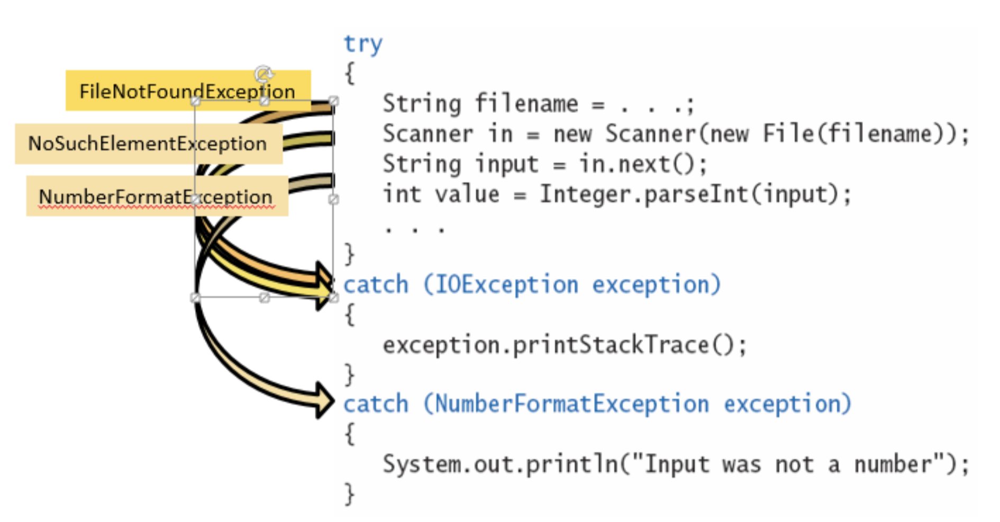

# CSC 151 - Chapter 7:  Input/Output and Exception Handling

This chapter we will learn to read and write text files, process command line arguments, throw and catch exceptions, and implement programs with checked exceptions.

## Reading and Writing Text Files

Reading and writing from text files is a very common practice while coding. Java has the `Scanner` class (which we have already used for user input from the console inside) to help the reading. We will also use a `File` class to help us access files.  _**These notes are a highlight of both `File` and `Scanner`. Feel free to go out to the API to see more.**_

### Reading

Let’s start by reading in from a file.  Make sure the actual file you want to read is within the project folder in Eclipse. It should not be in the `src` (source code) folder.

The first step is creating a file within the program. This does not actually create a real file at this point. This will help us establish a link between your file and the computer code. To start, create the File object:

```java
File inputFile = new File("Input.txt");
```

The variable `inputFile` is a made up name. Feel free to change the name. Also, the text inside the quotations should be the name of the file you are trying to access. Now we use the file we created to create a `Scanner`.

```java
Scanner in = new Scanner(inputFile);
```

Here is a shortcut:

```java
Scanner in = new Scanner(new File("Input.txt"));
```

The variable name of the `File` you created should be inside the parenthesis. The variable name, `in`, is a made up name. We can now use the `Scanner` like we did before to help us read in information.

> Important: To use `File` you need to import `java.io.File` and to use `Scanner` you need to import `java.util.Scanner`.

There are a couple new methods to help us read in information: `hasNextDouble()`, `hasNext()`, `hasNextLine()`, `hasNextInt()`. These methods will check to see if there is a value to read in before attempting to read. If you do not check, the program will crash if it tries to read in nothing.

Example:

```java
File inputFile = new File("input.txt");
Scanner in = new Scanner(inputFile);
while (in.hasNextDouble()) {
	double value = in.nextDouble();
	// more code
}
```

The example above reads in doubles from the input.txt file. It will read in all the doubles, until there are no more.

Again, in java we need to have all the code in a class, so here is a working example that you can modify and run ▶️

```java | {type: 'script'}
import java.io.File; // import File
import java.util.Scanner; // impoer Scanner

public class Chapter7 {

	public static void main(String [] args) {
      File inputFile = new File("/ljkassler/ch7/files/input.txt");
      Scanner in = new Scanner(inputFile);
      
      while (in.hasNextDouble()) {
         double value = in.nextDouble();

         // print the value read from file
         System.out.println(value);
      }
   }
}
```


### Writing

When creating an output file, you will use the `PrintWriter` class. Three big items to note with file output using `PrintWriter`:

- If the file already exists, the file will be emptied and the new contents will go into the file.  It does not append.   
- If the file does not exist, a new file will be created.
- If you do not close the file, the data will not write to the file.  

To construct the `PrintWriter`, you will create an object with a name (like the Scanner).

> Important: To use `PrintWriter` you need to import `java.io.PrintWriter`.

```java
PrintWriter out = new PrintWriter("output.txt");
```

With the line above, `out` is the variable name and `output.txt` if the output file. You will use the variable out to write to the file. You can use print and `println` to write to the files.

```java
out.println("Hello, World");
out.close();
```

### File Not Found Exception

There is one issue we have not addressed. If a file does not exist and you try to use the Scanner, you will get an error. A `FileNotFoundException` occurs and your program will crash. `PrintWriter` will also generate this error if you give an invalid file name or bad location. Java forces you to throw an exception (A type of error message), when there is a potential for this error to occur.

One way to a prevent Java from getting upset, is to add text to the main header.  You can `throw` an exception. What this will do is display a message and terminate the project. We will learn more about exceptions later in these notes.

> Important: To use `FileNotFoundException` you need to import `java.io.FileNotFoundException`.

Example:

```java
public static void main(String [] args) throws FileNotFoundException
```

### File Names and Webpages

When you are accessing a file, we generally save to the Project folder in this class. What happens in real life, when the file is someplace else? You will need to specify a location. Because of escape characters, you need to do a double backslash. If the file name is user input, they will not need to the double backslash.

```java
File inputFile = new File("C:\\homework\\input.txt");
```

You can also read in from a webpage. There will be no quiz questions/assessments on this topic, but it is useful. You just use a URL instead of a file and have to open a stream.

```java
String address = "http://horstmann.com/index.html";
URL pageLocation = new URL(address);
Scanner in = new Scanner(pageLocation.openStream());
```

### File Dialog Boxes

You can also use a pop up dialog box. Again this is not going to be accessed, but useful.

```java
JFileChooser chooser = new JFileChooser();
Scanner in = null;
if (chooser.showOpenDialog(null) == JFileChooser.APPROVE_OPTION) {
	File selectedFile = chooser.getSelectedFile();
	in = new Scanner(selectedFile);
	…
}
```

## Text Input and Output

Text can present problems while reading and writing data. White space characters and punctuation will create issues.

To read in words, you would use the next method. Please assume in the code below that the files and scanners have been set up correctly.

```java
while (in.hasNext()) {
	String input = in.next();
	System.out.println(input);
}
```

The code above would just read in a word at a time and print that word onto the screen. It would repeat until there are no more words. The white space characters in the code above would be consumed or used by the `next` method.

To read in lines, the process is very similar – except a few method name changes.

```java
while (in.hasNextLine()) {
	String input = in.nextLine();
	System.out.println(input)
}
```

Generally after a line is read in, the programmer will begin to process that line (or break it up). Next line is also great when you are reading in mixed input (words and numbers).

## Command Line Arguments

So far, we have ignored the part of the main heading that has `String [] args`. You should already know that this is a String array. `args` is short for arguments. Any input from the command line will be broken up by pace and saved into the args string array.

You can simulate command line arguments through Eclipse (under Run).

## Exception Handling

There are two main ways of dealing with errors, detection and handling. The programmer can program in the handling part of errors. Exception handling provides the ability to deal the error. This feature of java programming that allows us to handle the runtime errors caused by exceptions. 

### What is an exception?

An Exception is an unwanted event that interrupts the normal flow of the program. When an exception occurs program execution gets terminated. In such cases we get a system generated error message. The good thing about exceptions is that they can be handled in Java. By handling the exceptions we can provide a meaningful message to the user about the issue rather than a system generated message, which may not be understandable to a user.

There can be several reasons that can cause a program to throw exception. For example: Opening a non-existing file in your program, Network connection problem, bad input data provided by user etc.

**Errors** indicate that something severe enough has gone wrong, the application should crash rather than try to handle the error.

**Exceptions** are events that occurs in the code. A programmer can handle such conditions and take necessary corrective actions. Few examples:

- `NullPointerException` – When you try to use a reference that points to null.
- `ArithmeticException` – When bad data is provided by user, for example, when you try to divide a number by zero this exception occurs because dividing a number by zero is undefined.
- `ArrayIndexOutOfBoundsException` – When you try to access the elements of an array out of its bounds, for example array size is 5 (which means it has five elements) and you are trying to access the 10th element.

### Types of exceptions

There are two types of exceptions in Java:

- Checked exceptions
- Unchecked exceptions

#### Checked exceptions

All exceptions other than Runtime Exceptions are known as Checked exceptions as the compiler checks them during compilation to see whether the programmer has handled them or not. If these exceptions are not handled/declared in the program, you will get compilation error. For example, `SQLException`, `IOException`, `ClassNotFoundException` etc.

#### Unchecked Exceptions

Runtime Exceptions are also known as Unchecked Exceptions. These exceptions are not checked at compile-time so compiler does not check whether the programmer has handled them or not but it’s the responsibility of the programmer to handle these exceptions and provide a safe exit. For example, `ArithmeticException`, `NullPointerException`, `ArrayIndexOutOfBoundsException` etc.

Compiler will never force you to catch such exception or force you to declare it in the method using throws keyword.

Throwing exceptions is not hard. You just need a line of code:

```java
throw new IllegalArgumentException("error message: specify the issue");
```

### Try/Catch

However, it is more common to use a try/catch block.

Usually this is inside some try statement, but can also be within an if statement that is checking for the mistake.  Once the exception is thrown, it moves to the `catch` part of the code.  The `catch` code will deal with the mistake.  

You need to write a throw statement for unchecked exceptions (aka things not built in). You do not need to write the throw statement for checked exceptions (things built in). The checked exceptions are common errors, like trying to open a file that doesn’t exist.  

<div class="mx-auto" style="max-width: 600px;">



</div>

The finally clause is an optional clause that will always execute even if there is an error. It is a great place to close files and clean up any potential messes. It is rarely used because Java will automatically clean up and close files.

```java
public void printOutput(String filename) throws IOException {
   PrintWriter out = new PrintWriter(filename);
   try {
      writeData(out);   // Method may throw an I/O Exception
   }
   finally {
      out.close();   
   }
}
```

#### Try block

The try block contains set of statements where an exception can occur. A try block is always followed by a catch block, which handles the exception that occurs in associated try block. A try block must be followed by catch blocks or finally block or both.

#### Syntax of try block

```java
try {
   // statements that may cause an exception
}
```

While writing a program, if you think that certain statements in a program can throw a exception, enclosed them in try block and handle that exception

#### Catch block

A catch block is where you handle the exceptions, this block must follow the try block. A single try block can have several catch blocks associated with it. You can catch different exceptions in different catch blocks. When an exception occurs in try block, the corresponding catch block that handles that particular exception executes. For example if an arithmetic exception occurs in try block then the statements enclosed in catch block for arithmetic exception executes.

```java
catch (exception(type) e(object))‏ {
     // error handling code
}
```

#### Syntax of try catch in java

```java
try {
     // statements that may cause an exception
}
catch (exception(type) e(object))‏ {
     // error handling code
}
```

#### Example: try catch block

If an exception occurs in try block then the control of execution is passed to the corresponding catch block. A single try block can have multiple catch blocks associated with it, you should place the catch blocks in such a way that the generic exception handler catch block is at the last(see in the example below).

The generic exception handler can handle all the exceptions but you should place is at the end, if you place it at the before all the catch blocks then it will display the generic message. You always want to give the user a meaningful message for each type of exception rather then a generic message.

Try to run this example, and experiment with different values too ▶️

```java | {type: 'script'}
class Example1 {
   public static void main(String args[]) {

      int num1, num2;
      try {
         /* We suspect that this block of statement can throw 
          * exception so we handled it by placing these statements
          * inside try and handled the exception in catch block
          */
         num1 = 0;
         num2 = 62 / num1;
         System.out.println(num2);
         System.out.println("Hey I'm at the end of try block");
      }
      catch (ArithmeticException e) { 
         /* This block will only execute if any Arithmetic exception 
          * occurs in try block
          */
         System.out.println("You should not divide a number by zero");
      }
      catch (Exception e) {
         /* This is a generic Exception handler which means it can handle
          * all the exceptions. This will execute if the exception is not
          * handled by previous catch blocks.
          */
         System.out.println("Exception occurred");
      }

      System.out.println("I'm out of try-catch block in Java.");
   }
}
```

Output:

```
You should not divide a number by zero
I'm out of try-catch block in Java.
```
