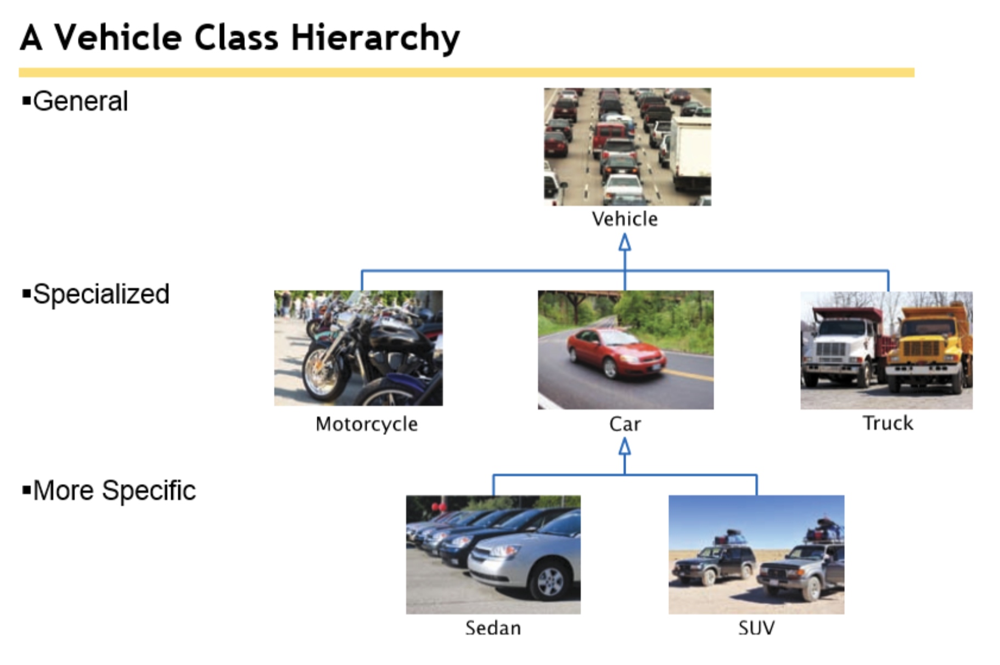

# CSC 151 - Chapter 9:  Inheritance and Interfaces

We will work to understand the concepts of interfaces, subclasses, superclasses, polymorphism, the Object class, and interfaces.    Objects from related classes usually share some common behavior.  Inheritance will allow the programmer to create relationships between specialized and general classes.   When the relationship is established, code can be shared between multiple classes.  

## Inheritance Hierarchies

<div class="mx-auto" style="max-width: 600px;">



</div>

Inheritance is a relationship between more general classes and more specialized classes. The super class is the more general class.  The subclass is more specific and inherits data and behavior from the superclass. This type of relationship is sometimes called an ‘is-a’ relationship.  In the image, you can see a vehicle hierarchy. A car is a vehicle.

You can always use a subclass object in place of a superclass object. This means you can pass in a Car object into a method that is requesting a Vehicle.

A new modifier, you should be aware of is “protected.”  When a variable or method is protected, it means all subclasses can see the item. (So can anyone else in the package)

## Implementing Subclasses

First, you don’t always need to use a super/sub class relationship. When setting up a subclass in java, you need to figure out what makes it different than its superclass. If the classes are not the different in your scenario, you may not need separate classes. If the behavior is the same, don’t break it down more.

However, if there are different behaviors, there are somethings to keep in mind. All instance variables that exist in the superclass also exist in the subclass, even if you don’t have direct access to them. You do not need to create the same variables over again. This is redundant. You do not have access to private variables directly, but those variables still describe the object created by the subclass.

You also have direct access to all public and protected methods. You also have the ability to override methods.   This means you are creating a method with the same name and updated functionality. The method in the subclass will override (and could use) the method in the superclass, if the name and parameters are the same. It is okay to create your own methods to change the implementation of methods that do not work for you. Luckily, Java knows to start with the subclass and work its way to the superclass when calling methods on an object.

There is a keyword, extends, that belongs in the class heading to denote inheritance.

Example:

```java
public class SubClassName extends SuperClassName {
    … 
    // Instance variables
    // Methods
    …
}
```

## Overriding Methods

We have already briefly covered this topic in the notes. Now we will expand on the idea. As you now know, a subclass inherits the methods from the superclass. If you are not happy with the behavior of an inherited method, you can override it by using the same method heading and providing new implementation.

You have two choices when overriding a method. First choice, it to make the implementation completely different than the superclass’s version of the method. The second choice is the use the superclass’s method and expand on the actions. To do this, you can use the keyword super. Super always refers to the superclass of your current class.  (_You must be extending a class for this to work._)

Example:

```java
public void myMethod(int x, int y) {
    super.myMethod(x,y);
    … 
    //More code here
    …
}
```

If you leave off super in the above implementation, it would create a recursive method, calling itself.

## Constructors

When creating the subclass, you also must create the super class. It is also uses the keyword `super`. Unless, you specify when creating the object, the default constructor will be called. The `super` keyword also must be the first line in the subclass’s constructor.

Example:

```java
public myClassName(String x, int y) {
    super(x);
    // Notice it is the first line. I did not include y
    // nor did I do super.SuperClass(x).  It is just the word super().

    // More code here...
}
```

## Polymorphism

This was briefly mentioned before, but a subclass method can be used when a superclass reference is expected. So, I can create all my methods in the driver to accept the superclass. However, if I only create subclass objects, this will still work. This idea is called polymorphism. Polymorphism (having multiple shapes) allows to manipulate objects that share a set of tasks, even though the tasks are executed in different ways.

To determine, which method was actually called Java does a dynamic method lookup. It will usually get this correct.  

## Abstract Classes

There are times when you are creating a class hierarchy that you may not know what the implementation of a method will be in the super class. However, you want to force the subclasses to implement those methods.

Abstract methods (and classes) will help you achieve this idea. An abstract method is a method whose implementation is not specified. Once a class has an abstract method, it becomes an abstract class. You cannot create (or instantiate) an abstract class. You cannot because not all methods have code. 

Abstract Method Example:

```java
public abstract void methodName();
```

Let’s create a pretend abstract class, subclass, and driver.

```java
// Abstract SuperClass
public abstract class Account {
    public abstract void deductFees();  // no method implementation
}

// Subclass -- Not abstract
public class SavingsAccount extends Account {
    // Provides an implementation
    public void deductFees() {
        // method implementation ...
    }
    // ...
}

// Driver, inside main
Account anAccount;                // OK: Reference to abstract object
anAccount = new Account();        // Error: Account is abstract
anAccount = new SavingsAccount(); // Concrete class is OK
anAccount = null;                 // OK
```

## Steps to Developing a Hierarchy

<div class="mx-auto" style="max-width: 250px;">


</div>

1. List all classes that are a part of the hierarchy.
2. Organizes the classes into an inheritance hierarchy. Use the chart method (easier).
3. Determine the common responsibilities.
4. Decided which methods are overridden in subclasses.  
5. Declare the public interface of each subclass.
6. Identify instance variables
7. Implement constructors and methods
8. Constructors objects of different subclasses and process them (driver).

## The Object class

Every class extends the Object class, even without you programming it in. It is an explicating extends. There are three items I want to look at from the Object class.

### toString Method

This method should return a string describing or representing the object. It usually is a selection of the instance variables formatting nicely into a single string. When using super and subclasses, I will regularly use the `super.toString()` in my subclass’s `toString` method.

For example, let’s pretend that I have a bank account object. Maybe I return the last four digits of 20 digit account number (`accountNum`) and the current balance (`balance`) to describe my bank account object.

```java
public String toString() {
	return accountNum.substring(16) + ": $" + balance;
}
```

### equals Method

The `equals` method checks whether two objects have the same content. (AGAIN – don’t use `==` with objects. It checks references.) The equals method must declare the same type of parameter as the Object equals method to override it. This means you must pass in the Object type. Once inside the method, you cast the object to your type.  The example below is a Stamp class.

#### Example:

```java
public class Stamp {
    private String color;
    private int value;
    
    public boolean equals(Object otherObject) {
        if (otherObject == null) {
            return false;
        }
        Stamp other = (Stamp) otherObject;
        return color.equals(other.color) && value == other.value;
    }
}
```

### instanceOf Operator

Use the instanceOf operator test whether an object belongs to a particular type.  It will return true or false.  This can help you prevent bad casting.

```java
SubClassObject obj = new SubClassObject();
if (obj instanceof SuperClassObject) {
    SuperClassObject newVariable = (SuperClassObject) obj;
}
```

## Interfaces

An interface is a way to force all users to have the same methods and develop a cohesive project. All methods within an interface are abstract. So they contain no code (implementation) other than the method declarations. The method headings contain the return types, names, and parameter variables of each method.

A great feature of interfaces is that you are allowed to implement more than interface in each class. You can use as many as you want. Just separate the names by a comma.


Declaring
Implementing
public interface InterfaceName
{
     Method declarations
}
public class ClassName implements InterfaceName1, InterfaceName2
{
   Instance Variables
   Constructors
   Methods (including interface’s methods)

} 
public interface Measurable
{
     double getMeasure();
}
public class BankAccount implements Measurable
{
   private double balance;
   …
   public double getMeasure()
   {
      return balance;
   }
}


<table>

<tr>
    <th>
        Declaring
    </th>
    <th>
        Implementing
    </th>
</tr>

<tr>
    <td>
        <pre class="hljs language-java">
public interface InterfaceName {
    Method declarations
}
        </pre>
    </td>

    <td>
    <pre>
    public class ClassName implements InterfaceName1, InterfaceName2 {
        Instance Variables
        Constructors
        Methods (including interface’s methods)
    }
    </pre>
    </td>


</tr>

<tr>
    <td>
        <pre class="hljs language-java">
public interface Measurable {
     double getMeasure();
}
        </pre>
    </td>

    <td>
    <pre>
    public class BankAccount implements Measurable {
        private double balance;
        public double getMeasure() {
            return balance;
        }
    }
    </pre>
    </td>
</tr>

</table>


Notice in the example above, the method heading I do not include public or abstract. This is okay. It is assumed that all of these will be public and abstract, so there is no need to type that in. All interfaces do not have instance variables or static methods. You can declare constant variables in an interface.

### Comparable Interface

The comparable interface will allow you to compare objects. You will implement the compareTo method that we learned about with strings. It is your choice how you handle the returns, as long as it follows this logic:

`a.compareTo(b)`
- Negative Number: if a comes before b`
- Zero: if and be are the same
- Positive Number: if b comes before a
